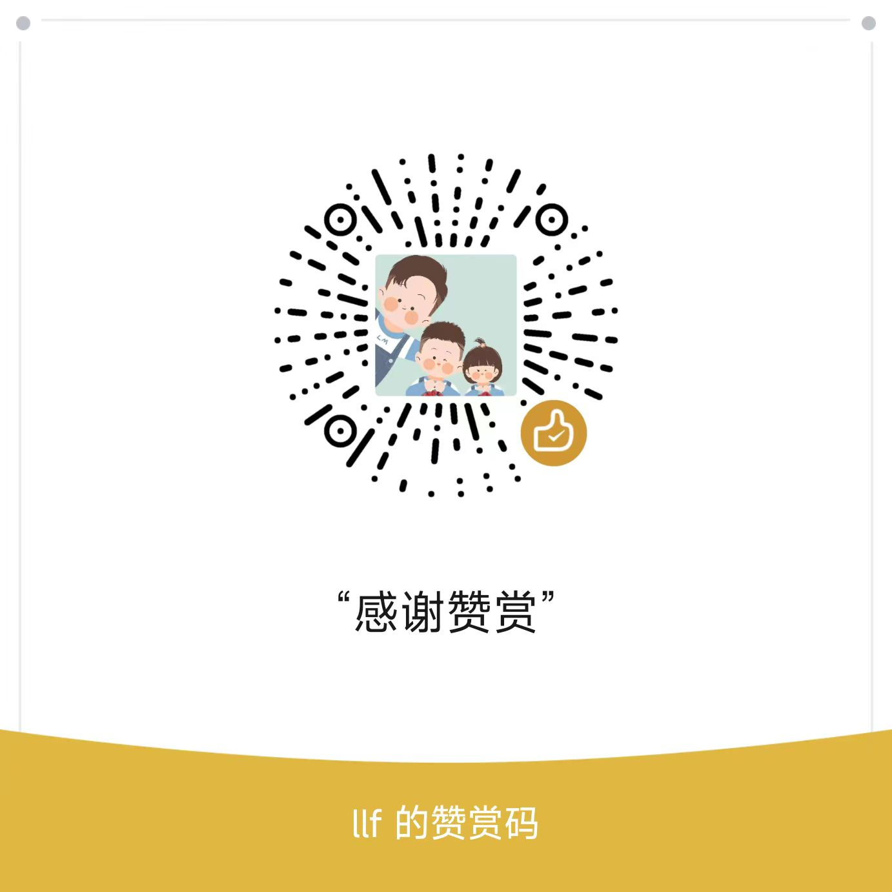

# abpvnext-vue
Abp Vnext 的 Vue 实现版本，基于abp vnext 框架的基础进行模部块化封装

# 公众号

公众号有详细的从零手把手搭建的教程系列，欢迎关注赞赏，有你的支持，一定会越来越好！
下面的是我的公众号二维码图片，欢迎关注。
 

教程系列：https://mp.weixin.qq.com/mp/appmsgalbum?__biz=MzI4MzY0NDU2NA==&action=getalbum&album_id=3433909918099324931#wechat_redirect

# 赞赏
如果你觉得到本教程对你有帮助，欢迎赞赏，有你的支持，一定会越来越好！
